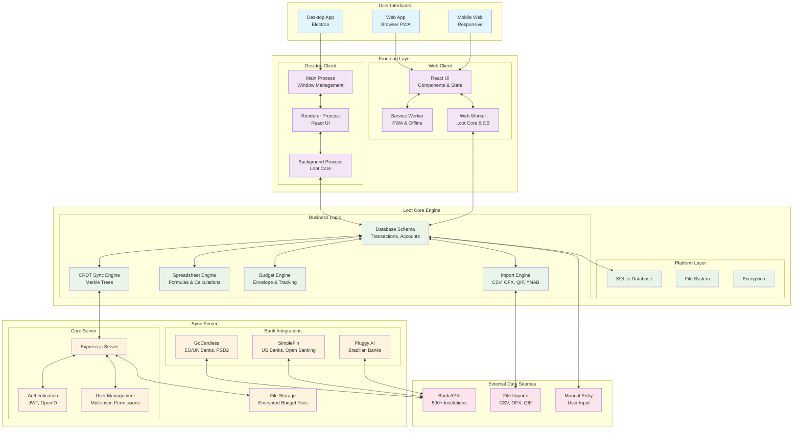
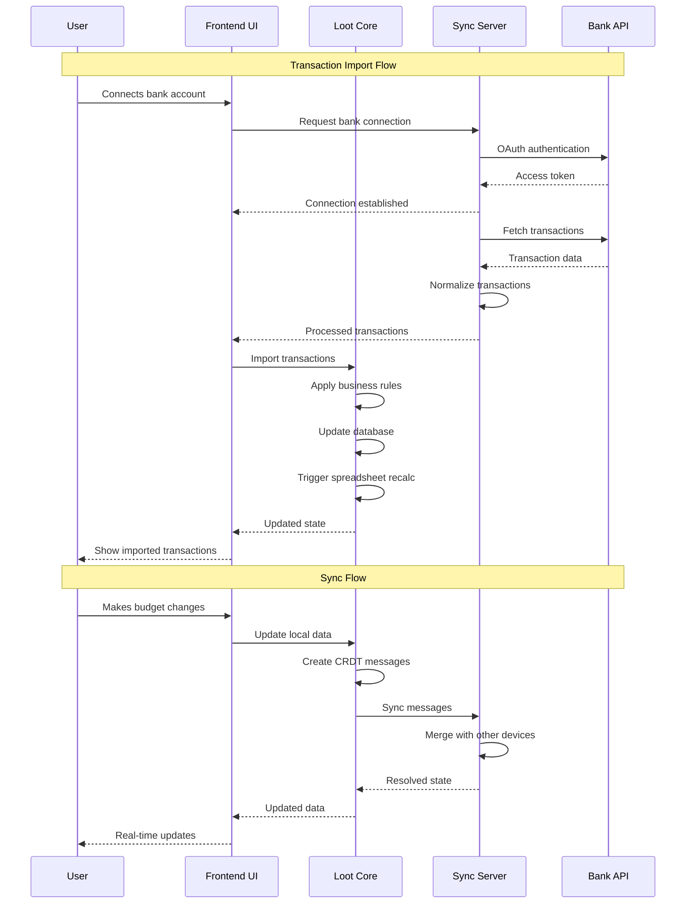
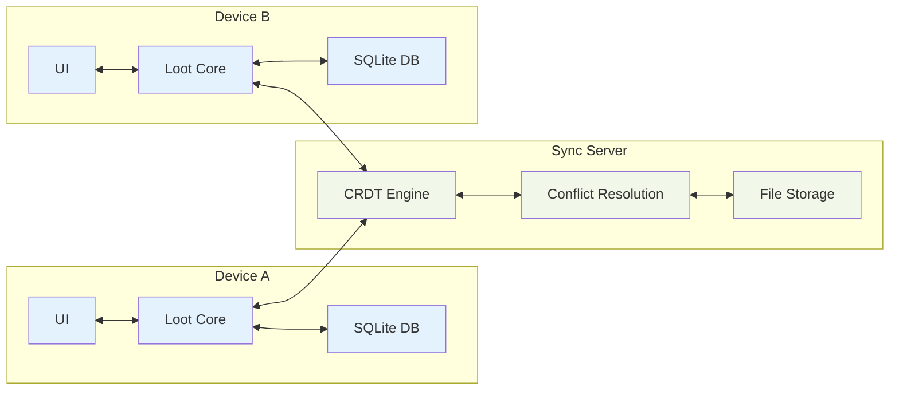

# Actual Budget App Architecture

Based on my analysis of the codebase, here's a comprehensive diagram of how the Actual budget app works:

## System Overview

```
┌─────────────────────────────────────────────────────────────────────────────┐
│                           ACTUAL BUDGET APP                                 │
│                                                                             │
│  ┌─────────────────┐    ┌─────────────────┐    ┌─────────────────┐         │
│  │   DESKTOP APP   │    │    WEB APP      │    │   SYNC SERVER   │         │
│  │   (Electron)    │    │   (Browser)     │    │   (Node.js)     │         │
│  └─────────────────┘    └─────────────────┘    └─────────────────┘         │
└─────────────────────────────────────────────────────────────────────────────┘
```

## Detailed Architecture

### 1. Frontend Layer

```
┌─────────────────────────────────────────────────────────────────────────────┐
│                              FRONTEND                                       │
├─────────────────────────────────────────────────────────────────────────────┤
│                                                                             │
│  ┌─────────────────────────────────────────────────────────────────────────┐│
│  │                    DESKTOP CLIENT (Electron)                           ││
│  │  packages/desktop-electron/                                             ││
│  │                                                                         ││
│  │  ┌─────────────────┐  ┌─────────────────┐  ┌─────────────────┐         ││
│  │  │   Main Process  │  │ Renderer Process│  │ Background Proc │         ││
│  │  │                 │  │                 │  │                 │         ││
│  │  │ • Window Mgmt   │  │ • React UI      │  │ • Loot Core     │         ││
│  │  │ • File Dialogs  │  │ • Components    │  │ • Database      │         ││
│  │  │ • Menu System   │  │ • State Mgmt    │  │ • Sync Engine   │         ││
│  │  │ • Auto Updates  │  │ • Spreadsheet   │  │ • Import/Export │         ││
│  │  │ • Sync Server   │  │                 │  │                 │         ││
│  │  └─────────────────┘  └─────────────────┘  └─────────────────┘         ││
│  └─────────────────────────────────────────────────────────────────────────┘│
│                                   │                                         │
│                                   │ IPC Communication                       │
│                                   │                                         │
│  ┌─────────────────────────────────────────────────────────────────────────┐│
│  │                      WEB CLIENT (Browser)                              ││
│  │  packages/desktop-client/                                               ││
│  │                                                                         ││
│  │  ┌─────────────────┐  ┌─────────────────┐  ┌─────────────────┐         ││
│  │  │    React UI     │  │ Service Worker  │  │   Web Worker    │         ││
│  │  │                 │  │                 │  │                 │         ││
│  │  │ • Components    │  │ • PWA Support   │  │ • Loot Core     │         ││
│  │  │ • Redux Store   │  │ • Offline Cache │  │ • AbsurdSQL     │         ││
│  │  │ • Router        │  │ • Updates       │  │ • Database      │         ││
│  │  │ • Themes        │  │                 │  │ • Sync Engine   │         ││
│  │  │ • i18n          │  │                 │  │                 │         ││
│  │  └─────────────────┘  └─────────────────┘  └─────────────────┘         ││
│  └─────────────────────────────────────────────────────────────────────────┘│
└─────────────────────────────────────────────────────────────────────────────┘
```

### 2. Core Engine Layer

```
┌─────────────────────────────────────────────────────────────────────────────┐
│                           LOOT CORE ENGINE                                  │
│                         packages/loot-core/                                 │
├─────────────────────────────────────────────────────────────────────────────┤
│                                                                             │
│  ┌─────────────────┐  ┌─────────────────┐  ┌─────────────────┐             │
│  │   PLATFORM      │  │    DATABASE     │  │      SYNC       │             │
│  │                 │  │                 │  │                 │             │
│  │ • SQLite        │  │ • Schema        │  │ • CRDT Engine   │             │
│  │ • File System   │  │ • Transactions  │  │ • Merkle Trees  │             │
│  │ • Async Storage │  │ • Accounts      │  │ • Timestamps    │             │
│  │ • Connection    │  │ • Categories    │  │ • Message Queue │             │
│  │ • Crypto        │  │ • Budgets       │  │ • Conflict Res  │             │
│  └─────────────────┘  └─────────────────┘  └─────────────────┘             │
│                                                                             │
│  ┌─────────────────┐  ┌─────────────────┐  ┌─────────────────┐             │
│  │   SPREADSHEET   │  │   IMPORTERS     │  │    BUDGET       │             │
│  │                 │  │                 │  │                 │             │
│  │ • Formula Calc  │  │ • CSV Parser    │  │ • Envelope      │             │
│  │ • Cell Updates  │  │ • OFX Parser    │  │ • Tracking      │             │
│  │ • Dependencies  │  │ • QIF Parser    │  │ • Categories    │             │
│  │ • Caching       │  │ • YNAB4/5       │  │ • Reports       │             │
│  │ • Transactions  │  │ • Rules Engine  │  │ • Forecasting   │             │
│  └─────────────────┘  └─────────────────┘  └─────────────────┘             │
└─────────────────────────────────────────────────────────────────────────────┘
```

### 3. Backend Layer

```
┌─────────────────────────────────────────────────────────────────────────────┐
│                            SYNC SERVER                                      │
│                       packages/sync-server/                                 │
├─────────────────────────────────────────────────────────────────────────────┤
│                                                                             │
│  ┌─────────────────┐  ┌─────────────────┐  ┌─────────────────┐             │
│  │   CORE SERVER   │  │  AUTHENTICATION │  │   USER MGMT     │             │
│  │                 │  │                 │  │                 │             │
│  │ • Express.js    │  │ • Password Auth │  │ • Multi-user    │             │
│  │ • File Storage  │  │ • OpenID        │  │ • Permissions   │             │
│  │ • Sync Engine   │  │ • JWT Tokens    │  │ • Admin Panel   │             │
│  │ • CRDT Merge    │  │ • Sessions      │  │ • File Sharing  │             │
│  │ • Encryption    │  │ • Rate Limiting │  │ • Access Control│             │
│  └─────────────────┘  └─────────────────┘  └─────────────────┘             │
│                                                                             │
│  ┌─────────────────────────────────────────────────────────────────────────┐│
│  │                        BANK SYNC INTEGRATIONS                          ││
│  │                                                                         ││
│  │  ┌─────────────────┐  ┌─────────────────┐  ┌─────────────────┐         ││
│  │  │   GOCARDLESS    │  │    SIMPLEFIN    │  │    PLUGGY AI    │         ││
│  │  │                 │  │                 │  │                 │         ││
│  │  │ • PSD2 API      │  │ • Open Banking  │  │ • Brazilian     │         ││
│  │  │ • 100+ Banks    │  │ • US Banks      │  │   Banks         │         ││
│  │  │ • EU/UK Focus   │  │ • Real-time     │  │ • AI-powered    │         ││
│  │  │ • Transaction   │  │ • Secure        │  │ • Modern API    │         ││
│  │  │   Normalization │  │                 │  │                 │         ││
│  │  └─────────────────┘  └─────────────────┘  └─────────────────┘         ││
│  └─────────────────────────────────────────────────────────────────────────┘│
└─────────────────────────────────────────────────────────────────────────────┘
```

### 4. Data Sources & External Systems

```
┌─────────────────────────────────────────────────────────────────────────────┐
│                           DATA SOURCES                                      │
├─────────────────────────────────────────────────────────────────────────────┤
│                                                                             │
│  ┌─────────────────┐  ┌─────────────────┐  ┌─────────────────┐             │
│  │  BANK IMPORTS   │  │  FILE IMPORTS   │  │  MANUAL ENTRY   │             │
│  │                 │  │                 │  │                 │             │
│  │ • GoCardless    │  │ • CSV Files     │  │ • Transaction   │             │
│  │ • SimpleFin     │  │ • OFX Files     │  │   Forms         │             │
│  │ • Pluggy AI     │  │ • QIF Files     │  │ • Bulk Edit     │             │
│  │ • Real-time     │  │ • YNAB4/5       │  │ • Categories    │             │
│  │   Transactions  │  │ • Custom Rules  │  │ • Rules         │             │
│  └─────────────────┘  └─────────────────┘  └─────────────────┘             │
│                                                                             │
│  ┌─────────────────────────────────────────────────────────────────────────┐│
│  │                         BANK CONNECTORS                                 ││
│  │                                                                         ││
│  │  • GoCardless                                                           ││
│  │  • Pluggy                                                               ││
│  │  • Simplefin                                                            ││
│  └─────────────────────────────────────────────────────────────────────────┘│
└─────────────────────────────────────────────────────────────────────────────┘
```

### 5. Data Flow Architecture

```
┌─────────────────────────────────────────────────────────────────────────────┐
│                              DATA FLOW                                      │
├─────────────────────────────────────────────────────────────────────────────┤
│                                                                             │
│  USER INPUT                                                                 │
│      │                                                                      │
│      ▼                                                                      │
│  ┌─────────────────┐                                                        │
│  │   FRONTEND UI   │ ◄──────────── Real-time Updates                       │
│  │  (React/Redux)  │                                                        │
│  └─────────────────┘                                                        │
│           │                                                                 │
│           ▼                                                                 │
│  ┌─────────────────┐    IPC/WebSocket    ┌─────────────────┐               │
│  │   LOOT CORE     │ ◄─────────────────► │  SYNC SERVER    │               │
│  │   (SQLite DB)   │                     │ (File Storage)  │               │
│  └─────────────────┘                     └─────────────────┘               │
│           │                                       │                        │
│           ▼                                       ▼                        │
│  ┌─────────────────┐                     ┌─────────────────┐               │
│  │  SPREADSHEET    │                     │  BANK SYNC APIs │               │
│  │    ENGINE       │                     │                 │               │
│  │ • Calculations  │                     │ • GoCardless    │               │
│  │ • Formulas      │                     │ • SimpleFin     │               │
│  │ • Budget Rules  │                     │ • Pluggy AI     │               │
│  └─────────────────┘                     └─────────────────┘               │
│           │                                       │                        │
│           ▼                                       ▼                        │
│  ┌─────────────────────────────────────────────────────────────┐           │
│  │                    SQLITE DATABASE                          │           │
│  │                                                             │           │
│  │  • accounts         • transactions    • categories         │           │
│  │  • payees          • budgets         • rules              │           │
│  │  • schedules       • notes           • sync_messages      │           │
│  │  • preferences     • mappings        • encryption_keys   │           │
│  └─────────────────────────────────────────────────────────────┘           │
└─────────────────────────────────────────────────────────────────────────────┘
```

### 6. Key Technologies & Dependencies

```
┌─────────────────────────────────────────────────────────────────────────────┐
│                           TECHNOLOGY STACK                                  │
├─────────────────────────────────────────────────────────────────────────────┤
│                                                                             │
│  FRONTEND:                          BACKEND:                               │
│  • React 19.1.0                    • Node.js                              │
│  • Redux Toolkit                   • Express.js 5.1.0                     │
│  • Electron 24.0                   • Better-SQLite3                       │
│  • Vite 6.3.5                      • bcrypt (auth)                        │
│  • TypeScript 5.8.3                • Winston (logging)                    │
│  • i18next (i18n)                  • Convict (config)                     │
│  • Recharts (charts)               • JWS (tokens)                         │
│                                                                             │
│  DATABASE:                          SYNC & CRDT:                           │
│  • SQLite (local)                  • Custom CRDT impl                     │
│  • AbsurdSQL (web)                 • Merkle trees                         │
│  • IndexedDB (fallback)            • Logical timestamps                   │
│  • File-based storage              • Message queues                       │
│                                                                             │
│  BUILD & DEV:                       EXTERNAL APIS:                        │
│  • Yarn workspaces                 • GoCardless (Nordigen)                │
│  • ESLint + Prettier               • SimpleFin Bridge                     │
│  • Playwright (E2E)                • Pluggy SDK                           │
│  • Vitest (testing)                • OpenID Connect                       │
│  • Docker support                  • OAuth 2.0                            │
└─────────────────────────────────────────────────────────────────────────────┘
```

### 7. Security & Encryption

```
┌─────────────────────────────────────────────────────────────────────────────┐
│                           SECURITY MODEL                                    │
├─────────────────────────────────────────────────────────────────────────────┤
│                                                                             │
│  LOCAL ENCRYPTION:                  SERVER SECURITY:                       │
│  • End-to-end encryption           • TLS/HTTPS only                        │
│  • AES-256 encryption              • Rate limiting                         │
│  • Key derivation (PBKDF2)         • Input validation                     │
│  • Salt + IV per file              • SQL injection protection             │
│  • Zero-knowledge sync             • XSS protection                       │
│                                                                             │
│  AUTHENTICATION:                    BANK INTEGRATION:                      │
│  • Password hashing (bcrypt)       • OAuth 2.0 flows                      │
│  • JWT tokens                      • PSD2 compliance                      │
│  • Session management              • Read-only access                     │
│  • OpenID Connect                  • Encrypted connections                │
│  • Multi-user support              • Token refresh                        │
└─────────────────────────────────────────────────────────────────────────────┘
```

## Key Features

### Budget Management
- **Envelope Budgeting**: Traditional zero-based budgeting system
- **Tracking Budget**: Income/expense tracking without strict allocation
- **Category Management**: Hierarchical category groups and categories
- **Goal Setting**: Budget goals with progress tracking
- **Rollover Logic**: Automatic carryover of unused budget amounts

### Transaction Processing
- **Real-time Sync**: CRDT-based conflict-free synchronization
- **Bank Integration**: Direct connection to 500+ banks worldwide
- **Import System**: Support for CSV, OFX, QIF, YNAB files
- **Rule Engine**: Automatic categorization and transformation
- **Reconciliation**: Match imported vs. manual transactions

### Data Architecture
- **Local-first**: SQLite database with offline support
- **Multi-device Sync**: End-to-end encrypted synchronization
- **Conflict Resolution**: CRDT ensures data consistency
- **Backup System**: Automatic local and cloud backups
- **Version Control**: Complete audit trail of all changes

### Platform Support
- **Desktop**: Native Electron app (Windows, Mac, Linux)
- **Web**: Progressive Web App with offline capabilities
- **Self-hosted**: Docker containers for private deployment
- **Mobile**: Responsive web interface optimized for mobile

This architecture enables Actual to be a robust, secure, and feature-rich personal finance application that can work offline while providing seamless multi-device synchronization when connected.

## Mermaid Architecture Diagram



## Component Interaction Flow



## Data Synchronization Model


