# Actual Budget App - Developer Architecture Guide

> **Welcome to Actual!** This guide explains how the Actual budget app is architected and organized to help new developers understand the codebase and contribute effectively.

## Quick Start for Developers

Actual is a **local-first personal finance app** with these key characteristics:

- **Multi-platform**: Desktop (Electron) and Web (PWA) apps
- **Local-first**: Works offline with SQLite database
- **Real-time sync**: Optional server for multi-device synchronization
- **Bank integration**: Connects to 500+ banks worldwide
- **Privacy-focused**: End-to-end encryption, zero-knowledge sync

### Key Insight: Frontend + Backend in One App

When Actual runs, it actually runs **two things simultaneously**:
1. **Frontend**: React-based web UI
2. **Backend**: Local database server (called "Loot Core")

> **Important**: This "backend" is **not** a remote server - it's a local background process/worker that handles database operations, shared logic, and sync.

## High-Level Architecture

## Package Structure

The project uses **Yarn workspaces** with these main packages:

```mermaid
graph TB
    subgraph "External Systems"
        BankAPIs["Bank API Connectors"]
        OpenID["OpenID Providers"]
        APIClient["Api Clients"]
    end

    subgraph "Core Engine"
        LC["📊 loot-core
        • Shared logic
        • SQLite database
        • CRDT sync
        • Budget calculations
        • Import/export logic
        • Spreadsheet engine"]
    end

    subgraph "Backend Services"
        SS["🔄 sync-server
        • Integrated Web Client
        • Multi-device Sync
        • Express.js server
        • User management
        • End-to-end encryption"]
        API["🔌 api
        • Programmatic control
        • Data Import
        • Data Export"]
    end

    subgraph "Frontend Layer"
        DC["🎨 desktop-client
        • React UI Components
        • Shared web/desktop UI
        • Redux state management
        • Themes & styling"]
        CL["🧩 component-library
        • Reusable Components
        • Design system
        • UI primitives
        • Shared components"]
    end

    subgraph "Platform Wrappers"
        DE["🖥️ desktop-electron
        • integrated sync-server
        • Desktop App Shell
        • Electron main process
        • File system access"]
    end

    subgraph "User Applications"
        DesktopApp["Desktop App
        Windows, Mac, Linux"]
        WebApp["Web Client
        Browser PWA"]
    end

    %% External connections
    BankAPIs <--> SS
    OpenID <--> SS
    APIClient <--> API

    %% Backend flow
    SS <--> LC
    SS <--> LC
    API <--> LC

    %% Frontend flow
    LC <--> DC
    CL --> DC

    %% Platform connections
    DE --> DC
    DE --> LC

    %% User app connections
    DesktopApp --> DE
    WebApp --> DC
    WebApp --> LC

    %% Styling
    classDef external fill:#fce4ec,stroke:#e91e63,stroke-width:2px
    classDef core fill:#e8f5e8,stroke:#4caf50,stroke-width:3px
    classDef backend fill:#fff3e0,stroke:#ff9800,stroke-width:2px
    classDef frontend fill:#e1f5fe,stroke:#2196f3,stroke-width:2px
    classDef platform fill:#f3e5f5,stroke:#9c27b0,stroke-width:2px
    classDef userapp fill:#e0f2f1,stroke:#009688,stroke-width:3px

    class BankAPIs,DevTools external
    class LC core
    class SS,API backend
    class DC,CL frontend
    class DE platform
    class DesktopApp,WebApp userapp
```

### Package Responsibilities

| Package | Type | Primary Role | Key Technologies |
|---------|------|--------------|------------------|
| **loot-core** | Core Engine | Shared logic, database communication, sync | SQLite, CRDT, Custom spreadsheet engine |
| **sync-server** | Backend Service | Multi-device sync, bank integrations | Express.js, OAuth, End-to-end encryption |
| **api** | Backend Service | API for developers | Programmatic access |
| **desktop-client** | Frontend | Shared React UI for web & desktop | React, Redux |
| **desktop-electron** | Platform Wrapper | Desktop app shell and native features | Electron, IPC, File system |
| **component-library** | Frontend | Reusable UI components | React components, Design system |

## Core Components Deep Dive

### 1. Desktop Client (`packages/desktop-client/`)

**What it does**: React-based UI that works in both desktop app and web environments.

**Key directories**:
- `src/components/` - All React components organized by feature
- `src/hooks/` - Custom React hooks for state management
- `src/style/` - CSS modules and theme system
- `src/browser-preload.browser.js` - Web app initialization
- `src/browser-server.js` - Web worker setup

**Entry points**:
- **Web**: `index.html` → React app with Web Worker
- **Desktop**: Same React app but in Electron renderer process

### 2. Loot Core (`packages/loot-core/`)

**What it does**: The "backend" that runs locally - handles all shared logic, database operations, and sync.

**Architecture**:

**Communication**:
- **Desktop**: Background process communicates via WebSocket/IPC
- **Web**: Web Worker communicates via `postMessage`

### 3. Desktop Electron (`packages/desktop-electron/`)

**What it does**: Electron main process that creates windows, manages files, and spawns the Loot Core background process.

**Key files**:
- `index.ts` - Main entry point, window creation
- `menu.ts` - Application menu setup
- `preload.ts` - Secure communication bridge
- `server.ts` - Manages Loot Core background process

### 4. Sync Server (`packages/sync-server/`)

**What it does**: Node.js server for multi-device sync and bank connections.

**Features**:
- CRDT-based conflict resolution
- End-to-end encryption
- Multi-user support
- Bank sync integrations (GoCardless, SimpleFin, Pluggy)

## Data Flow & Communication

### Desktop App Flow

### Web App Flow

### Sync Flow

## Architecture Diagrams

### System Overview

### Component Communication Flow

### Data Synchronization Model

